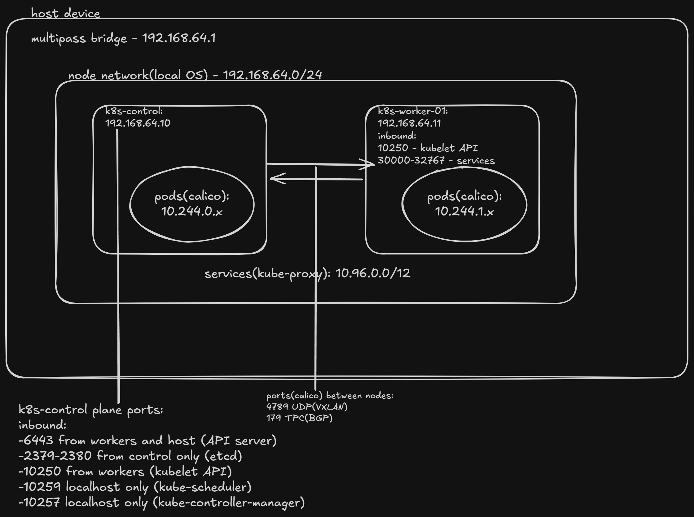

# Cluster Architecture

## Context
This is an outline for building a local homelab on a laptop for practicing for the CKA/CKS exams.

## Network Design

## Node Sizing
### Control plane sizing
2CPU/4GB RAM - etcd is memory hungry even though 2GB is the min

### Worker sizing
2CPU/2GB RAM - just enough for 3-4 pods for practice

### Disk
Control plane: 20GB (etcd BC/DR practice)
Workers: 15GB (images can vary)

### No HA control plane
HA would require an odd number for etcd quorum though for the purposes of the homelab on a laptop to practice for the CKA/CKS exams the above will be used.

### CNI: Calico over Flannel
NetworkPolicy support required for CKS and Calico supports it natively. Flannel requires additional overhead for supporting NetworkPolicy.

### K8s Distribution: kubeadm over k3s/kind
CKA exam uses kubeadm, k3s abstracts too much, kind is for CI testing not multi-node practice.